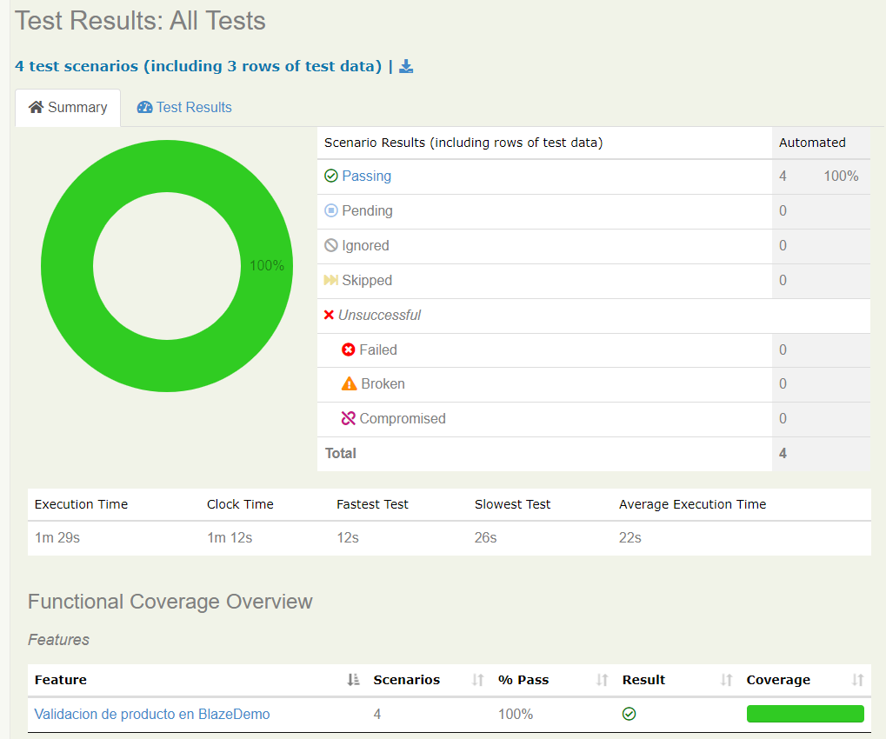
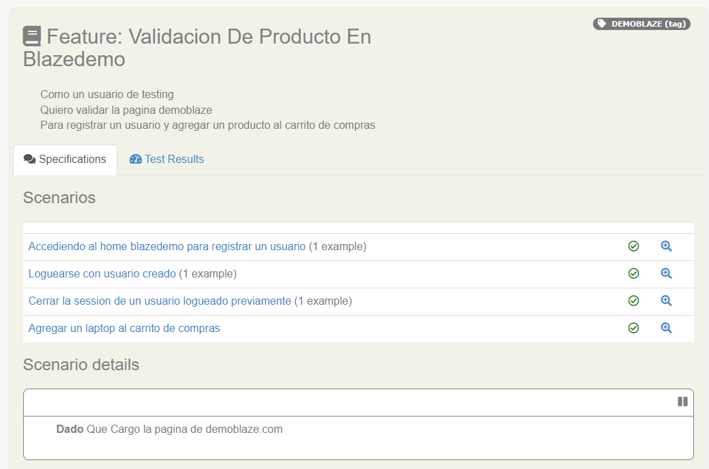
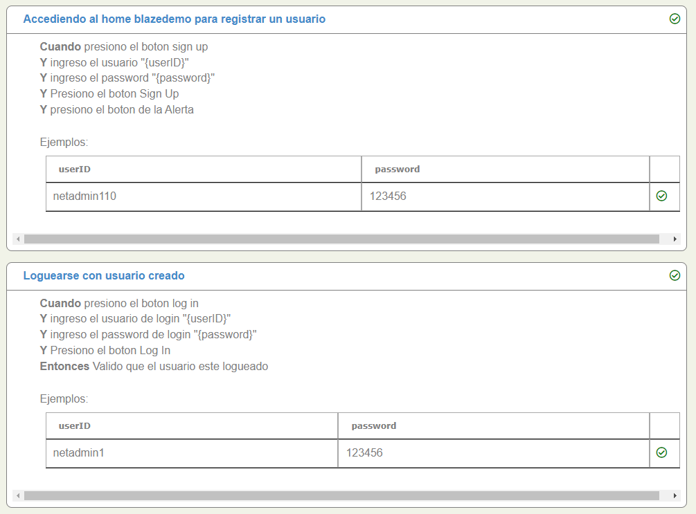
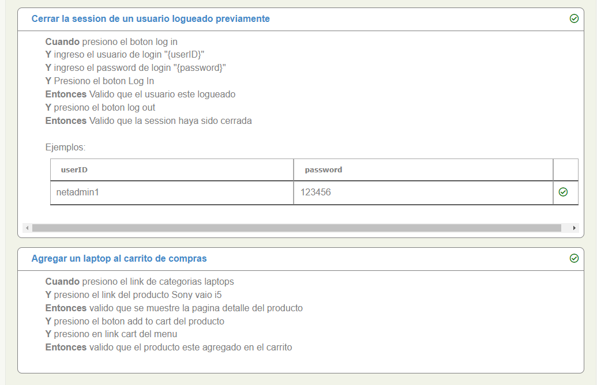

# Demo Automatizacion Web con Serenity BDD

En el demo se redactan los casos en Gherkin y luego se van mapeando los metodos para acceder a la páginas.

###### Página para automatización: https://www.demoblaze.com/index.html

#### Ejercicios del Demo

- Dar de alta a un usuario.
- Login y Logout con el usuario dado de alta.
- Agregar una laptop al carrito.
- Comprobar que se agregó el producto al carrito.

#### Comando para ejecutar y obtener los reportes

```
$ mvn clean verify "-Dcucumber.options=--tags @DEMOBLAZE"
```

#### Config file pom.xml

```
    <properties>
        <serenity.version.core>2.0.54</serenity.version.core>
        <serenity.version.junit>2.0.54</serenity.version.junit>
        <serenity.version.cucumber>1.6.4</serenity.version.cucumber>
    </properties>
    
    <dependencies>
        <!-- https://mvnrepository.com/artifact/net.serenity-bdd/serenity-core -->
        <dependency>
            <groupId>net.serenity-bdd</groupId>
            <artifactId>serenity-core</artifactId>
            <version>${serenity.version.core}</version>
            <scope>test</scope>
        </dependency>
        <!-- https://mvnrepository.com/artifact/net.serenity-bdd/serenity-junit -->
        <dependency>
            <groupId>net.serenity-bdd</groupId>
            <artifactId>serenity-junit</artifactId>
            <version>${serenity.version.junit}</version>
            <scope>test</scope>
        </dependency>
        <!-- https://mvnrepository.com/artifact/net.serenity-bdd/serenity-cucumber -->
        <dependency>
            <groupId>net.serenity-bdd</groupId>
            <artifactId>serenity-cucumber</artifactId>
            <version>${serenity.version.cucumber}</version>
            <scope>test</scope>
        </dependency>
    </dependencies>
```

## Reportes




